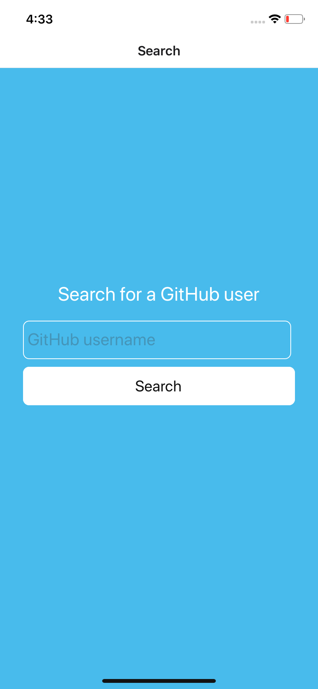
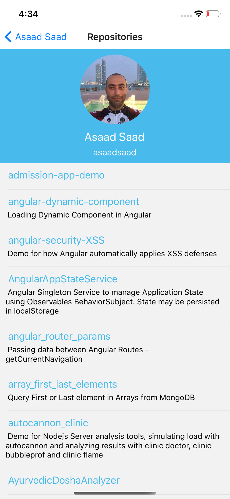

The following ReactNative Expo project is to search and display information about GitHub profiles. Clone the repo and install all deps.
The application should boot a Stack Navigation with the following structure:
* Search (main page, users will search for a certain GitHub account)
* Dashboard (Displays the account picture, with 3 buttons to display: Profile, Repositories, and Notes)
* Profile (Displays profile details about the GitHub account)
* Repositories (Displays the latest repos for the GitHub account)
* WebView (Browse the source code for a certain repo)
* Notes (Add local notes)
  
## Project Requirements
1. Start by completing the code for `App.js` to meet the above requirements.
2. Complete the code for `Search.js` screen, which has the following state: `{username, loading, error}`, Display an input with a button to search for a GitHub account, your form should avoid the keyboard, and focused on the input element. Your screen will show an activity indicator from `loading` state and and `error` if we fail to fetch the GitHub information. Fetch the user GitHub profile details from `https://api.github.com/users/account` replace account with GitHub account name. After you fetch the profile details, take the user to the Dashboard screen.
3. Complete the code for `Dashboard.js` screen to display the user profile picture from `avatar_url` and show 3 buttons to display the Profile, Repositories, Notes screens. The Dashboard screen must show the user's full name on the navigation header.
4. Complete the code for `ProfileDetails.js` screen, where you need to display the following:
  * Display the `<Badge />` component which expects a prop called `userInfo` with the following object: `{avatar_url, name, login}`, you don't need to modify `Badge.js`, just use it.
  * Display the following details about the user profile: `[company, location, followers, following, email, bio]`
5. Complete the code for `Repositories.js` screen, you will have to fetch the information from `repos_url` property. 
  * The component has the following state `{list, loading, error}`.
  * This screen will display the `<Badge />` component, and a `ScrollView` list of the user repos seperated by the `<Separator />` component. 
  * When the user clicks on the repository name, take the user to the WebView screen and pass the `html_url`. Note that `WebView` screen is expecting a parameter `url`.
  * Manage showing an activity indicator or error state.
6. Complete the code for the `Note.js` screen, 
  * This screen will display the `<Badge />` component, and a `ScrollView` list of the user notes seperated by the `<Separator />` component. At the end it will show an input to allow users adding notes. *(Notes are to be displayed only and you don't have to worry about persisting them)*. 
  * The screen has the following state `{notes, note}`.

## Notes  
* Always use the provided StyleSheet object.
* Do not upload any zip files into your repo
* Do not push any deps (node_modules)
* Remember to honor the project integrity and authenticity of your code
    
## Please find screenshots for the finished application  

  
  
  
  

